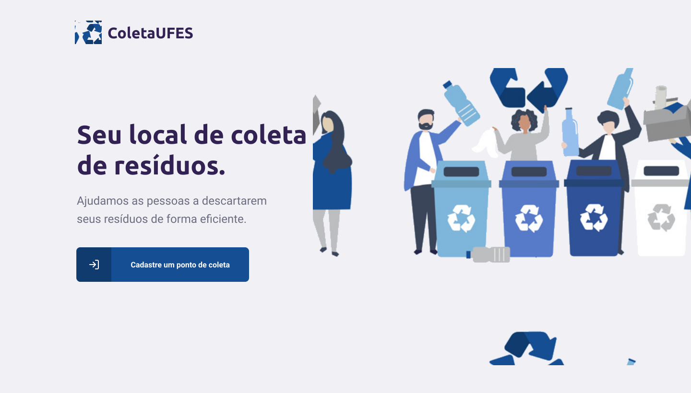
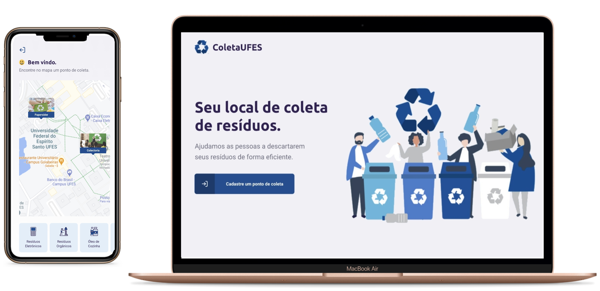

<h1 align="center">
    
</h1>

<h4 align="center"> 
	ColetaUFES 1.0 🚀
</h4>

<p align="center">
 <a href="#information_source-o-que-é-o-coletaufes?">O que é o ColetaUFES</a>&nbsp;&nbsp;&nbsp;|&nbsp;&nbsp;&nbsp;
  <a href="#-projeto">Projeto</a>&nbsp;&nbsp;&nbsp;|&nbsp;&nbsp;&nbsp;
  <a href="#rocket-Tecnologias">Tecnologias</a>&nbsp;&nbsp;&nbsp;|&nbsp;&nbsp;&nbsp;
  <a href="#-layout">Layout</a>&nbsp;&nbsp;&nbsp;|&nbsp;&nbsp;&nbsp;
  <a href="#information_source-como-usar">Como usar</a>&nbsp;&nbsp;&nbsp;|&nbsp;&nbsp;&nbsp;
  <a href="#-projetos-finais-(mobile-e-web)">Projetos finais (Mobile e Web)</a>&nbsp;&nbsp;&nbsp;|&nbsp;&nbsp;&nbsp;
</p>

## :information_source: O que é o ColetaUFES?

O ColetaUFES é uma plataforma para que empresas registrem pontos de coletas de eletrônicos, lâmpadas, óleo de cozinha,
entre outros. Os pontos ficam na UFES, facilitando que qualquer pessoa encontre facilmente o local de descarte correto
do seu lixo. O projeto surgiu para a disciplina de Computação e Sociedade da UFES.


## 💻 Projeto

O objetivo é conectar pessoas a empresas que coletam resíduos específicos, como lâmpadas, baterias, óleo de cozinha etc, facilitando a coleta e ajudando o meio ambiente.

<h1 align="center">
    
    
</h1>


## :rocket: Tecnologias

Esse projeto foi desenvolvido usando as seguintes tecnologias:

- [Node.js][nodejs]
- [TypeScript][typescript]
- [React][reactjs]
- [React Native][rn]
- [Expo][expo]

## 🔖 Layout

Para acessar o layout da aplicação use [Figma](https://www.figma.com/file/HRlDySB3veeJLQGsuAeWnw/ColetaUFES?node-id=0%3A1).

## :information_source: Como usar

Para copiar e executar essa aplicação você precisa do [Git](https://git-scm.com), [Node.js][nodejs] + [Yarn][yarn] intalados no seu computador.

No terminal digite:

### Instalar API 

```bash
# Clonar esse repositório
$ git clone https://github.com/andreocunha/coletaufes.git

# Vá para o ropositório
$ cd ColetaUFES/server

# Instale as dependências
$ yarn install

# Executar as Migrates
$ yarn knex:migrate

# Executar as Seeds
$ yarn knex:seed

# Iniciar o servidor
$ yarn dev

# running on port 3333
```

### Instalar Front-end

```bash
# Clonar esse repositório
$ git clone https://github.com/andreocunha/coletaufes.git

# Vá para o ropositório
$ cd ColetaUFES/web

# Instale as dependências
$ yarn install

# Execute
$ yarn start

# running on port 3000
```

### Instalar Mobile

```bash
# Clonar esse repositório
$ git clone https://github.com/andreocunha/coletaufes.git

# Vá para o ropositório
$ cd ColetaUFES/mobile

# Instale as dependências
$ yarn install

# Execute
$ yarn start

# O Expo vai abrir, você pode escanear o QR Code que aparecerá no terminal ou na página web usando o app da Expo no seu celular.

# Se aparecer algum problema com fontes, encerre a aplicação no terminal "CONTROL + C", execute:
$ expo install expo-font @expo-google-fonts/ubuntu @expo-google-fonts/roboto

# E execute novamente
$ yarn start

```

<!-- ### Projetos finais (Mobile e Web) -->

<!-- <h1 align="center">
    
</h1> -->

Feito com ♥ por André Oliveira Cunha :wave: [Linkedin](https://www.linkedin.com/in/andr%C3%A9-oliveira-cunha-b26b3a156/)

[nodejs]: https://nodejs.org/
[typescript]: https://www.typescriptlang.org/
[expo]: https://expo.io/
[reactjs]: https://reactjs.org
[rn]: https://facebook.github.io/react-native/
[yarn]: https://yarnpkg.com/